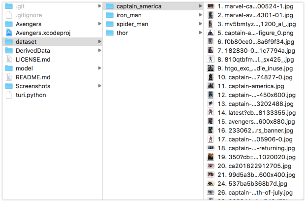

# Turi-Create-Example

    pip install turicreate
    
    
Collect the dataset of images and structure the dataset folder in this way

First run turi.py file to generate the Sframe and then run train.py to train the models and export it in CoreML format

Turi Create docs - https://github.com/apple/turicreate
